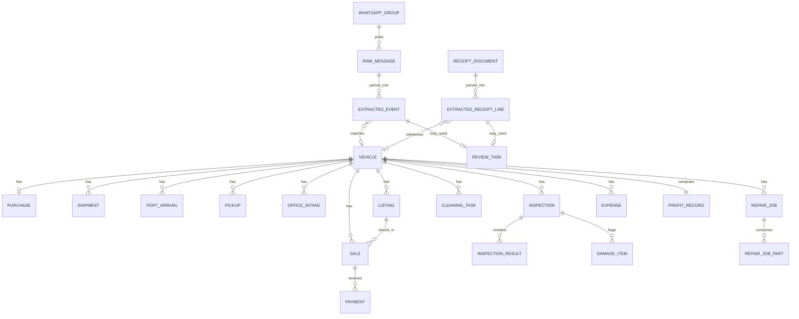

# Phase 2 — Entity Identification

Entities are grouped by domain. Cardinalities are noted because they drive Phase 3's key design (several relationships are 1:N even though the "happy path" is 1:1 — the exception loops from Phase 1 force this).

## 1. Reference / Master Data

| Entity | Definition | Key Attributes | Notes |
|---|---|---|---|
| **Branch** | A dealership location. | branch_id, name, address | Single row today; every fact table carries branch_id from day one so multi-branch is a config change, not a re-architecture. |
| **Staff** | Any person who touches a vehicle: owner, driver, inspector, mechanic, cleaner, salesperson, finance. | staff_id, name, phone (WhatsApp number), branch_id | One person can hold multiple roles — see **StaffRole** below. |
| **StaffRole** | Join entity: which role(s) a staff member performs. | staff_id, role_code | Supports "small team, multiple hats" directly. |
| **AuctionHouse** | Where vehicles are bought abroad. | auction_house_id, name, country | |
| **Vendor** | Supplier of parts or services (not the auction). | vendor_id, name, contact | |
| **Part** | Parts catalog. | part_id, name, category | |
| **DataSource** | Lookup: Google Form, WhatsApp Group Agent, Receipt Agent, Manual Entry. | source_code, description | Tags every record's origin; feeds the "% from WhatsApp vs. Forms" KPI from Phase 4. |
| **InspectionChecklistItem** | Configurable checklist line (e.g., "Engine — compression test", "Body — panel alignment"). | item_id, category, label, active_flag | Supports the "mostly formal, but flexible" inspection you confirmed — items are data, not hard-coded, so informal ad hoc notes still fit via a free-text item. |

## 2. Vehicle Lifecycle

| Entity | Definition | Key Attributes | Relationships |
|---|---|---|---|
| **Vehicle** | The central entity. One row per physical vehicle, VIN as natural key. | vehicle_id (surrogate), vin, make, model, year, auction_lot_no, current_stage, current_status | Everything below hangs off this. |
| **Purchase** | The auction purchase event. | purchase_id, vehicle_id, auction_house_id, staff_id (buyer), price, currency, purchase_date | 1:1 with Vehicle in the normal case; kept as its own table (not columns on Vehicle) so a cancelled/re-purchased vehicle has clean history. |
| **Shipment** | Ocean freight leg. | shipment_id, vehicle_id, carrier, bill_of_lading_no, etd, eta, ata | 1:N — re-shipment after a damage/insurance exception is possible. |
| **PortArrival** | Arrival + customs clearance status. | port_arrival_id, vehicle_id, arrival_date, clearance_status, cleared_date | 1:N — a clearance dispute can generate multiple status rows over time (needed for the "stuck at customs" alert in Phase 7). |
| **Pickup** | Driver collects vehicle from port. | pickup_id, vehicle_id, staff_id (driver), pickup_date, odometer, source_id | source_id → DataSource; a Pickup row can originate from a Form **or** a confirmed WhatsApp ExtractedEvent. |
| **OfficeIntake** | Vehicle arrives at office. | intake_id, vehicle_id, intake_date, source_id | Same dual-source pattern as Pickup. |

## 3. Inspection & Repair

| Entity | Definition | Key Attributes | Relationships |
|---|---|---|---|
| **Inspection** | One inspection pass. | inspection_id, vehicle_id, staff_id (inspector), inspection_date, overall_result, source_id | 1:N per vehicle — the inspect↔repair loop from Phase 1 means a vehicle can have several. |
| **InspectionResult** | One checklist line's result within an Inspection. | result_id, inspection_id, item_id, pass_fail, notes | Supports formal checklist rows; a free-text-only item covers informal cases. |
| **DamageItem** | A specific defect flagged during inspection. | damage_id, inspection_id, part_id, severity, description | |
| **RepairJob** | A unit of repair work addressing one or more damage items. | repair_job_id, vehicle_id, damage_id (nullable, can span several), staff_id (mechanic), start_date, end_date, status, source_id | 1:N per vehicle. |
| **RepairJobPart** | Parts consumed by a repair job. | line_id, repair_job_id, part_id, vendor_id, qty, unit_cost | Feeds FactRepair cost in Phase 4. |
| **CleaningTask** | Cleaning event. | cleaning_id, vehicle_id, staff_id, date, status | 1:N — re-clean exception. |

## 4. Sales & Finance

| Entity | Definition | Key Attributes | Relationships |
|---|---|---|---|
| **Listing** | One listing attempt (price/channel/photos). | listing_id, vehicle_id, price, channel, listed_date, status | 1:N — a fallen-through sale relists as a **new** Listing row, not an edit, preserving price-history. |
| **Customer** | Buyer. | customer_id, name, phone, address | Optional fields — cash walk-in buyers may have minimal data. |
| **Sale** | A finalized (or attempted-then-reversed) sale. | sale_id, vehicle_id, listing_id, customer_id, staff_id (salesperson), agreed_price, sale_date, status | status includes `reversed` for fall-through, so it's never hard-deleted — Phase 1's rework loop requires this. |
| **Payment** | One payment against a sale (supports installments). | payment_id, sale_id, amount, method, payment_date | 1:N per Sale. |
| **Expense** | Any cost not already captured above (customs fees, transport, misc.). | expense_id, vehicle_id (nullable), category, amount, currency, expense_date, source_id | Nullable vehicle_id because some expenses are overhead, not vehicle-specific — flagged as an assumption below. |
| **ProfitRecord** | Computed margin per vehicle. | vehicle_id, total_cost, total_revenue, profit, calculated_at | **Derived in Gold layer**, not manually entered — recalculated whenever a late cost/invoice lands (supports the "post-sale cost correction" exception from Phase 1). |

## 5. Automated Intake (WhatsApp Agents)

| Entity | Definition | Key Attributes | Relationships |
|---|---|---|---|
| **WhatsAppGroup** | A monitored group (per branch, potentially). | group_id, name, branch_id | |
| **RawMessage** | Untouched ingested group message (Bronze). | message_id, group_id, sender_phone, sent_at, text, media_urls, raw_payload | 1:N → ExtractedEvent (one message can reference multiple vehicles). |
| **ExtractedEvent** | LLM-parsed structured event from a RawMessage (Silver). | event_id, message_id, vehicle_id (nullable until matched), event_type, extracted_fields, confidence_score, review_status, reviewed_by, reviewed_at | On confirmation, feeds Pickup / OfficeIntake / RepairJob (progress notes) etc. via the source_id pattern above. |
| **ReceiptDocument** | Raw receipt image/PDF sent to the dedicated number (Bronze). | receipt_id, sender_phone, sent_at, file_url | 1:N → ExtractedReceiptLine (one receipt can have several line items). |
| **ExtractedReceiptLine** | OCR/LLM-parsed line from a receipt (Silver). | line_id, receipt_id, vehicle_reference, vendor, amount, currency, receipt_date, confidence_score, review_status | On confirmation, feeds Purchase price or Expense. |
| **ReviewTask** | Unified human-review queue item. | task_id, source_type (`extracted_event` \| `extracted_receipt_line`), source_id, assigned_to, status, resolved_at | One queue for staff to work from, instead of two separate ones — recommended over keeping review fields siloed on each table. |

## Entity-Relationship Sketch

## Assumptions flagged for confirmation

1. **Expense allocation** — some expenses (e.g., general transport, shared customs handling fees) may not tie to a single vehicle. I've made `Expense.vehicle_id` nullable; confirm whether unallocated/overhead expenses should be split across vehicles in a batch, or tracked separately from per-vehicle profit.
2. **ReviewTask as a unified queue** — recommended so staff work one queue instead of two; confirm this matches how you'd want a person to actually process flagged items day to day.
3. **RepairJob to DamageItem** — modeled as one repair job can address multiple damage items loosely; confirm whether repairs are billed/tracked per damage item or as one lump job per vehicle per repair cycle.
