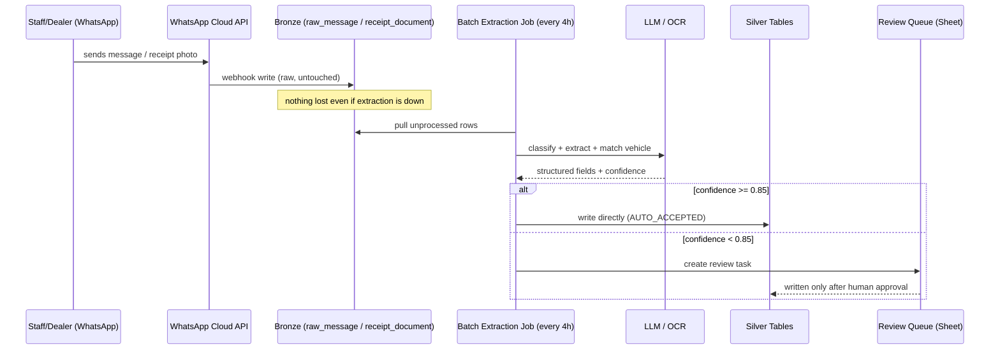

# Phase 5b & 5c — WhatsApp Agent Design

Both agents share one architecture pattern: **webhook → Bronze (raw, untouched) → scheduled batch extraction (LLM/OCR) → confidence gate → Silver (trusted) or review queue.** Batch, not streaming, per your brief — a job every few hours is enough freshness for a physical vehicle process and is far more debuggable than a real-time pipeline.

---

## 5b. WhatsApp Group Ingestion Agent

### Architecture

1. **Ingress**: Meta WhatsApp Cloud API (or a BSP — Twilio/Gupshup/360dialog if you want a faster local setup and support in Nigeria) registered webhook on the staff group. Every message — text, image, or document — lands via webhook POST.
2. **Bronze write**: webhook handler does the absolute minimum — writes the raw payload to the `raw_message` table (Phase 3), keyed on `whatsapp_message_id` for idempotency. No parsing here. If the webhook handler crashes or the LLM is down, nothing is lost.
3. **Batch extraction job** (e.g., every 4 hours, Databricks Job): selects all `raw_message` rows not yet processed, runs each through an LLM structured-extraction call.
4. **Vehicle matching**: the extraction prompt is given the list of currently "open" vehicles at that branch (VIN, lot no., make/model, current stage) so it can match "the blue 2016 Camry that just came in" to a specific `vehicle_id` — not just extract text blindly.
5. **Confidence gate** (see thresholds below) → either writes directly into the relevant Silver table (`pickup`, `office_intake`, `repair_job` progress note, etc., with `source_id = WHATSAPP_GROUP_AGENT`) or creates a `review_task`.

### Message classification schema

Each message is classified into one `event_type`, with a JSON `extracted_fields` payload:

| event_type | Example message | extracted_fields |
|---|---|---|
| `PICKUP` | "Driver Musa picked up the Camry from Apapa this morning" | `{vehicle_ref, driver_name, pickup_date}` |
| `OFFICE_ARRIVAL` | "Camry is at the office now" | `{vehicle_ref, arrival_date}` |
| `INSPECTION_NOTE` | "Checked the Camry, engine and body fine, needs bumper" | `{vehicle_ref, notes, implied_damage}` |
| `REPAIR_PROGRESS` | "Bumper fixed on the Camry, working on AC now" | `{vehicle_ref, progress_notes, status_hint}` |
| `CUSTOMS_UPDATE` | "Camry still held at port, waiting on duty payment" | `{vehicle_ref, hold_reason}` |
| `IGNORE` | Stickers, greetings, off-topic chat | — (retained in Bronze, never enters the review queue) |

### Confidence thresholds

- **≥ 0.85** — auto-accept, written directly to Silver, `review_status = AUTO_ACCEPTED`. Still fully auditable back to the raw message.
- **0.50 – 0.85** — written to `review_task`, normal priority. A staff member (recommend: whoever normally does data entry, or the inspector) approves/edits/rejects.
- **< 0.50** — written to `review_task`, low priority, or auto-rejected if `event_type = IGNORE`. Kept in Bronze regardless — nothing is thrown away, only gated from becoming "trusted" data.

### Human review — kept simple deliberately

Given the existing Google-Sheets-heavy workflow, the review queue is a Google Sheet (`Review_Queue`), refreshed by the same batch job, with columns: original message text, extracted event, matched vehicle, confidence, and an Approve/Reject dropdown. Apps Script writes the resolution back to `review_task` / `extracted_event`. This avoids building a bespoke review UI for v1 — worth reconsidering only if review volume grows large enough to need something faster.

---

## 5c. Receipt Intake Agent

### Architecture

1. **Ingress**: same Cloud API/BSP setup, on a **separate dedicated WhatsApp Business number** given to dealers specifically for receipts (kept separate from the staff group so extraction logic doesn't have to guess intent from a mixed stream).
2. **Bronze write**: image/PDF saved to a Unity Catalog Volume (blob storage), a `receipt_document` row created with the file URL, keyed on `whatsapp_message_id`.
3. **Batch extraction job**: for each new receipt, run OCR/Document AI (Google Document AI or Azure Document Intelligence handle printed auction invoices well) with a vision-LLM fallback for handwritten or low-quality photos — auction receipts are often crumpled phone photos, so plan for the fallback to be the common path, not the exception.
4. **Extraction output** per receipt (one or more `extracted_receipt_line` rows): vendor, amount, currency, receipt date, and any vehicle reference visible (VIN, auction lot number, or plate).
5. **Vehicle matching**: prefer explicit reference (VIN/lot number). If absent, match against open `purchase` records with no confirmed receipt yet, within a date and amount tolerance (e.g., ±3 days, ±5%) — surfaced as a suggested match, not auto-accepted, since money is involved.
6. **Confidence gate**: same three-tier structure as 5b, but the review queue for receipts should always show the original image alongside the extracted numbers — a reviewer needs to see the receipt, not just trust OCR text.
7. **Reconciliation check**: when a receipt line matches a `purchase` record, compare its amount to the Form-entered purchase price. A mismatch beyond a small tolerance doesn't auto-correct — it raises a `review_task` flagged as a **discrepancy**, since this is exactly the kind of thing that should have eyes on it before it hits the Gold profit numbers.

### Open question worth confirming

Is the dedicated number strictly for **purchase receipts**, or will dealers also send repair-invoice or customs-fee receipts to the same number? The architecture handles either case (the extraction step classifies receipt category, routing to `purchase` reconciliation vs. `expense`) — just flagging that "purchase receipts only" vs. "any receipt" changes what the matching logic should assume by default.

---

## Sequence (both agents, batch cadence)

