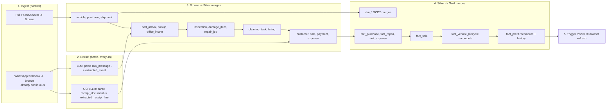

# Phase 6 — ETL/ELT & Lakehouse Architecture

## Unity Catalog structure

```
Catalog: dealership_prod  (dealership_dev mirrors this for testing)
├── bronze
│   ├── form_purchase_raw, form_shipment_raw, form_port_arrival_raw,
│   │   form_pickup_raw, form_inspection_raw, form_repair_raw,
│   │   form_cleaning_raw, form_listing_raw, form_sale_raw
│   ├── raw_message, receipt_document          (WhatsApp agents write here directly)
│   ├── ingestion_watermark                    (control table, see below)
│   └── dead_letter                            (failed rows from any source)
├── silver
│   └── (one table per Phase 3 entity: vehicle, purchase, shipment,
│        port_arrival, pickup, office_intake, inspection, inspection_result,
│        damage_item, repair_job, repair_job_part, cleaning_task, listing,
│        customer, sale, payment, expense, extracted_event,
│        extracted_receipt_line, review_task, vehicle_stage_history)
├── gold
│   └── (Phase 4 dim_* and fact_* tables)
└── Volumes
    └── bronze.raw_media   (receipt images/PDFs, WhatsApp media attachments)
```

One catalog per environment (dev/prod) rather than per branch — branch is a dimension (`branch_id`), not a catalog boundary, so adding a second dealership location later is a data change, not a platform change.

## Bronze — raw, append-only, schema-on-read

**Google Forms/Sheets**: a Python job (Databricks Job, Google Sheets API) pulls new rows since the last watermark and appends to the matching `form_*_raw` table, tagging `ingestion_batch_id` and `ingested_at`. The watermark itself is tracked in `bronze.ingestion_watermark` (one row per form: `form_name`, `last_pulled_row`, `last_run_at`) — this is what makes the pull incremental instead of a full re-read every run.

**WhatsApp agents**: the webhook receiver (a small always-on service — Azure Function/AWS Lambda/lightweight container, not a Databricks job) writes directly to `raw_message` / `receipt_document` on message arrival, keyed on `whatsapp_message_id`. This part is the one place closer to real-time than batch — but only the *landing* is immediate; nothing downstream reads it until the next scheduled extraction run. Media files go to the `raw_media` Volume; the Bronze row stores the path.

## Silver — cleaned, deduped, conformed to Phase 3 entities

Bronze → Silver is a `MERGE`, not an append, keyed on the natural id from each source (`form_response_id`, `whatsapp_message_id`). This is what gives idempotent re-runs and handles the case where a form gets resubmitted as a correction.

```sql
MERGE INTO silver.purchase AS tgt
USING (
  SELECT * FROM bronze.form_purchase_raw
  WHERE ingestion_batch_id = :batch_id
) AS src
ON tgt.source_record_id = src.form_response_id
WHEN MATCHED AND src.updated_at > tgt.updated_at THEN UPDATE SET
  price_amount = src.price_amount,
  price_currency = src.currency,
  updated_at = src.updated_at
WHEN NOT MATCHED THEN INSERT (
  vehicle_id, price_amount, price_currency, purchase_date,
  source_id, source_record_id, created_at, updated_at
) VALUES (
  src.vehicle_id, src.price_amount, src.currency, src.purchase_date,
  (SELECT source_id FROM silver.data_source WHERE source_code = 'GOOGLE_FORM'),
  src.form_response_id, src.ingested_at, src.ingested_at
);
```

For the two WhatsApp-sourced Silver writes (`extracted_event`, `extracted_receipt_line`), the batch extraction job (Phase 5b/5c) *is* the Bronze→Silver step — the LLM/OCR call happens between the two layers, and the confidence gate decides whether the row also gets mirrored into the relevant operational Silver table (`pickup`, `repair_job`, etc.) or stops at the extraction table pending review.

**Data quality checks enforced at Silver** (Delta Lake constraints / Delta Live Tables expectations): `vehicle_id` must exist in `silver.vehicle` (referential integrity), dates not in the future, prices/amounts positive, required fields non-null. Rows failing a check are **not** silently dropped — they're written to `bronze.dead_letter` with the failing rule and the original row, and counted for the Phase 7 alert.

## Gold — star schema, ready for BI

Silver → Gold uses Delta **Change Data Feed** so each Gold refresh only processes rows that actually changed in Silver, not a full re-scan.

- Dimensions (`dim_vehicle`, `dim_staff`) use SCD Type 2 merges — a change in `stage`/`status` closes the current row (`effective_to = now()`, `is_current = false`) and inserts a new one, rather than overwriting.
- `fact_vehicle_lifecycle` is maintained as an **accumulating snapshot**: `MERGE ... WHEN MATCHED THEN UPDATE` on `vehicle_key`, filling in the next milestone date and derived day-counts as each stage completes.
- `fact_profit` is recalculated (not appended) whenever a cost or sale record affecting that vehicle changes; every recalculation also appends a row to `fact_profit_history` for auditability — this is the direct answer to "insert/update/delete" and "historical tracking" for the one place in the model where mutation is the correct behavior, not an anti-pattern.

## Error handling

- **Dead-letter table** (`bronze.dead_letter`): schema mismatches, unparseable JSON, extraction exceptions, and DQ check failures all land here with `error_reason`, `raw_payload`, `retry_count`, `first_seen_at`.
- **Retry logic**: transient failures (LLM timeout, OCR service throttling) retry up to 3 times with exponential backoff inside the batch job before falling to dead-letter.
- **Alerting**: Phase 7 automation watches dead-letter row count and DQ failure rate; both feed the Ops/Data-Quality dashboard (Phase 8).

## Orchestration (Databricks Workflows)



Silver merges run in dependency order (vehicle first — everything else FKs to it) rather than all-parallel, even though most of the individual merges are cheap; the ordering avoids a race where, say, a repair job merge runs before its vehicle row exists.
